# Recko v4 — GST Reconciliation & Audit Intelligence Platform
## Complete Production-Ready Architecture

---

## Table of Contents
1. [System Overview](#system-overview)
2. [High-Level Architecture Diagram](#high-level-architecture-diagram)
3. [Folder Structure](#folder-structure)
4. [API Structure](#api-structure)
5. [Database Schema](#database-schema)
6. [Background Jobs](#background-jobs)
7. [Security Architecture](#security-architecture)
8. [Storage Architecture](#storage-architecture)
9. [Deployment Architecture](#deployment-architecture)
10. [Core Workflow Pipeline](#core-workflow-pipeline)

---

## 1. System Overview

Recko v4 is a **multi-tenant SaaS platform** that automates GST reconciliation by:
- Ingesting Purchase Registers and GSTR-2B data
- Running Reconlify CLI for reconciliation
- Detecting duplicates and mismatch categories
- Providing vendor-level analysis and audit-grade reports

### User Roles
| Role | Access Scope |
|---|---|
| **Auditor** | Assigned reconciliation jobs, read/write on own firm's data |
| **CA Firm Admin** | Manages firm users, all jobs within firm, billing |
| **Internal Admin** | Full platform access, tenant management, system health |

---

## 2. High-Level Architecture Diagram

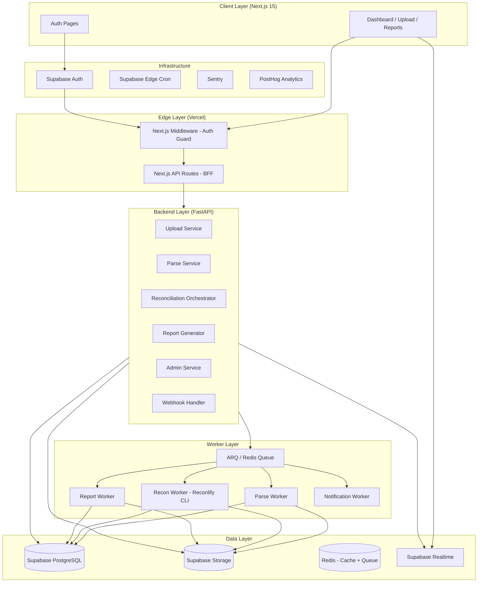

---

## 3. Folder Structure

### 3.1 Frontend — Next.js 15 App Router

```
recko-web/
├── app/
│   ├── (auth)/
│   │   ├── login/
│   │   │   └── page.tsx
│   │   ├── signup/
│   │   │   └── page.tsx
│   │   └── layout.tsx
│   ├── (dashboard)/
│   │   ├── layout.tsx                    # Sidebar + Header shell
│   │   ├── page.tsx                      # Dashboard home
│   │   ├── reconciliations/
│   │   │   ├── page.tsx                  # All jobs list
│   │   │   ├── new/
│   │   │   │   └── page.tsx              # Upload wizard
│   │   │   └── [jobId]/
│   │   │       ├── page.tsx              # Job overview
│   │   │       ├── mismatches/
│   │   │       │   └── page.tsx          # Mismatch table
│   │   │       ├── duplicates/
│   │   │       │   └── page.tsx          # Duplicate flags
│   │   │       ├── vendors/
│   │   │       │   └── page.tsx          # Vendor analysis
│   │   │       └── reports/
│   │   │           └── page.tsx          # Report download
│   │   ├── vendors/
│   │   │   └── page.tsx                  # Vendor master
│   │   ├── audit-trail/
│   │   │   └── page.tsx
│   │   ├── settings/
│   │   │   ├── profile/page.tsx
│   │   │   ├── firm/page.tsx
│   │   │   ├── users/page.tsx
│   │   │   └── billing/page.tsx
│   │   └── admin/                        # Internal admin only
│   │       ├── tenants/page.tsx
│   │       ├── jobs/page.tsx
│   │       └── system/page.tsx
│   ├── api/                              # BFF (Backend-for-Frontend)
│   │   ├── auth/
│   │   │   └── callback/route.ts
│   │   ├── jobs/
│   │   │   ├── route.ts                  # GET list, POST create
│   │   │   └── [jobId]/
│   │   │       ├── route.ts
│   │   │       └── status/route.ts
│   │   ├── upload/
│   │   │   └── presign/route.ts          # Presigned URL issuer
│   │   ├── reports/
│   │   │   └── [jobId]/route.ts
│   │   └── webhooks/
│   │       └── fastapi/route.ts          # Internal webhook receiver
│   ├── globals.css
│   └── layout.tsx
│
├── components/
│   ├── ui/                               # Shadcn UI base components
│   ├── layout/
│   │   ├── Sidebar.tsx
│   │   ├── Header.tsx
│   │   └── TenantSwitcher.tsx
│   ├── reconciliation/
│   │   ├── UploadWizard.tsx
│   │   ├── JobStatusBadge.tsx
│   │   ├── JobProgressRing.tsx
│   │   ├── MismatchTable.tsx
│   │   ├── DuplicateTable.tsx
│   │   └── ReconSummaryCard.tsx
│   ├── vendors/
│   │   ├── VendorRiskBadge.tsx
│   │   └── VendorStatsChart.tsx
│   ├── charts/
│   │   ├── MismatchBreakdownChart.tsx
│   │   └── TaxExposureChart.tsx
│   └── shared/
│       ├── DataTable.tsx
│       ├── FileDropzone.tsx
│       ├── RealtimeJobTracker.tsx
│       └── ConfirmDialog.tsx
│
├── hooks/
│   ├── useReconJob.ts
│   ├── useJobRealtime.ts
│   ├── usePresignedUpload.ts
│   └── useTenant.ts
│
├── lib/
│   ├── supabase/
│   │   ├── client.ts                     # Browser client
│   │   ├── server.ts                     # Server client (RSC)
│   │   └── middleware.ts
│   ├── api/
│   │   ├── jobs.ts                       # Typed API client
│   │   ├── reports.ts
│   │   └── vendors.ts
│   ├── validations/
│   │   ├── upload.schema.ts
│   │   └── job.schema.ts
│   └── utils/
│       ├── formatters.ts
│       └── gst.ts                        # GSTIN validators, formatters
│
├── middleware.ts                          # Auth guard + tenant routing
├── types/
│   ├── database.types.ts                 # Supabase generated types
│   ├── api.types.ts
│   └── domain.types.ts
│
└── config/
    ├── site.ts
    └── nav.ts
```

---

### 3.2 Backend — FastAPI

```
recko-api/
├── app/
│   ├── main.py                           # FastAPI app factory
│   ├── config.py                         # Settings via pydantic-settings
│   ├── dependencies.py                   # Shared DI (db, auth, tenant)
│   │
│   ├── api/
│   │   └── v1/
│   │       ├── router.py                 # Aggregates all routers
│   │       ├── auth/
│   │       │   └── router.py             # JWT validation endpoints
│   │       ├── jobs/
│   │       │   ├── router.py
│   │       │   ├── schemas.py
│   │       │   └── service.py
│   │       ├── upload/
│   │       │   ├── router.py
│   │       │   └── service.py
│   │       ├── reconciliation/
│   │       │   ├── router.py
│   │       │   ├── schemas.py
│   │       │   └── service.py
│   │       ├── vendors/
│   │       │   ├── router.py
│   │       │   └── service.py
│   │       ├── reports/
│   │       │   ├── router.py
│   │       │   └── service.py
│   │       ├── admin/
│   │       │   ├── router.py
│   │       │   └── service.py
│   │       └── webhooks/
│   │           └── router.py
│   │
│   ├── core/
│   │   ├── security.py                   # JWT decode, RBAC
│   │   ├── tenant.py                     # Tenant context resolution
│   │   ├── exceptions.py
│   │   └── logging.py
│   │
│   ├── db/
│   │   ├── session.py                    # AsyncPG connection pool
│   │   └── repositories/
│   │       ├── base.py
│   │       ├── jobs_repo.py
│   │       ├── mismatches_repo.py
│   │       ├── vendors_repo.py
│   │       └── tenants_repo.py
│   │
│   ├── workers/
│   │   ├── queue.py                      # ARQ worker setup
│   │   ├── tasks/
│   │   │   ├── parse_task.py             # Parse PR + 2B files
│   │   │   ├── recon_task.py             # Run Reconlify CLI
│   │   │   ├── report_task.py            # Generate Excel/PDF reports
│   │   │   └── notify_task.py            # Email / webhook notify
│   │   └── worker_settings.py
│   │
│   ├── services/
│   │   ├── parser/
│   │   │   ├── purchase_register.py      # Pandas parser for PR
│   │   │   ├── gstr2b.py                 # Pandas parser for GSTR-2B JSON/Excel
│   │   │   └── normalizer.py             # Canonical field mapping
│   │   ├── reconciliation/
│   │   │   ├── reconlify_runner.py       # subprocess wrapper for Reconlify CLI
│   │   │   ├── mismatch_classifier.py    # Rule-based mismatch categories
│   │   │   └── duplicate_detector.py     # Fuzzy + exact duplicate logic
│   │   ├── vendor/
│   │   │   ├── risk_scorer.py
│   │   │   └── aggregator.py
│   │   ├── report/
│   │   │   ├── excel_generator.py        # OpenPyXL templates
│   │   │   └── pdf_generator.py          # WeasyPrint / Jinja2
│   │   └── storage/
│   │       └── supabase_storage.py       # Upload/download wrappers
│   │
│   └── models/
│       ├── job.py
│       ├── tenant.py
│       ├── vendor.py
│       └── mismatch.py
│
├── tests/
│   ├── unit/
│   ├── integration/
│   └── fixtures/
│
├── alembic/                              # DB migrations
│   ├── versions/
│   └── env.py
│
├── scripts/
│   ├── seed_dev.py
│   └── run_worker.py
│
├── pyproject.toml
├── Dockerfile
└── docker-compose.dev.yml
```

---

## 4. API Structure

### 4.1 API Versioning Strategy

All endpoints live under `/api/v1/`. The Next.js BFF proxies authenticated requests to FastAPI. Internal service-to-service calls use a shared secret header.

```
Base URL: https://api.recko.app/api/v1
Auth: Bearer <supabase_jwt>
Tenant: X-Tenant-ID: <tenant_id>  (resolved from JWT claims)
```

---

### 4.2 Endpoint Reference

#### Jobs

| Method | Path | Description | Auth |
|--------|------|-------------|------|
| `GET` | `/jobs` | List all jobs (paginated, filtered) | Auditor+ |
| `POST` | `/jobs` | Create new recon job | Auditor+ |
| `GET` | `/jobs/{job_id}` | Job detail + status | Auditor+ |
| `DELETE` | `/jobs/{job_id}` | Soft-delete job | CA Admin |
| `GET` | `/jobs/{job_id}/status` | Realtime polling fallback | Auditor+ |
| `POST` | `/jobs/{job_id}/retry` | Re-queue failed job | CA Admin |

#### Upload

| Method | Path | Description | Auth |
|--------|------|-------------|------|
| `POST` | `/upload/presign` | Issue presigned URL for direct S3 upload | Auditor+ |
| `POST` | `/upload/confirm` | Confirm upload, trigger parse pipeline | Auditor+ |

#### Reconciliation

| Method | Path | Description | Auth |
|--------|------|-------------|------|
| `GET` | `/recon/{job_id}/summary` | Reconciliation summary stats | Auditor+ |
| `GET` | `/recon/{job_id}/mismatches` | Paginated mismatch records | Auditor+ |
| `GET` | `/recon/{job_id}/duplicates` | Detected duplicates | Auditor+ |
| `PATCH` | `/recon/{job_id}/mismatches/{id}` | Annotate / resolve mismatch | Auditor+ |
| `GET` | `/recon/{job_id}/vendors` | Per-vendor reconciliation breakdown | Auditor+ |

#### Reports

| Method | Path | Description | Auth |
|--------|------|-------------|------|
| `POST` | `/reports/{job_id}/generate` | Queue report generation | Auditor+ |
| `GET` | `/reports/{job_id}` | List generated reports | Auditor+ |
| `GET` | `/reports/{job_id}/download` | Signed download URL | Auditor+ |

#### Admin (Internal Only)

| Method | Path | Description | Auth |
|--------|------|-------------|------|
| `GET` | `/admin/tenants` | List all tenants | Admin |
| `POST` | `/admin/tenants` | Create tenant | Admin |
| `GET` | `/admin/tenants/{id}/jobs` | All jobs for tenant | Admin |
| `GET` | `/admin/system/health` | Queue + DB health | Admin |
| `GET` | `/admin/system/metrics` | Usage metrics | Admin |

---

### 4.3 API Pipeline Flow (Job Creation)

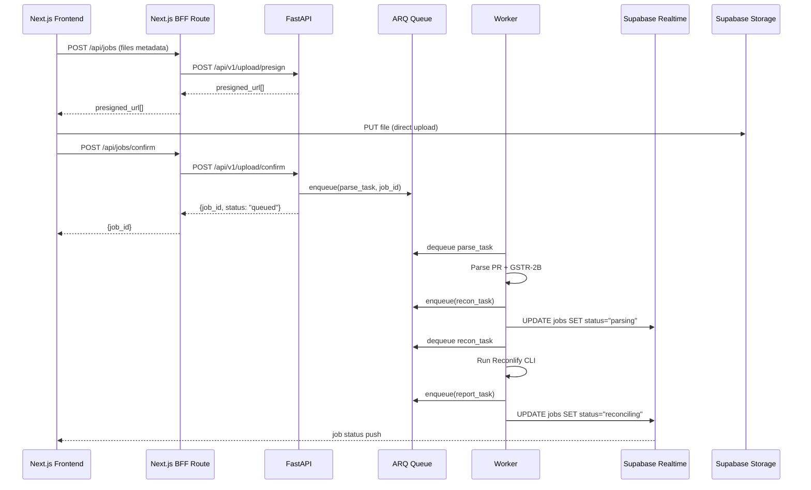

---

## 5. Database Schema

### 5.1 Schema Diagram

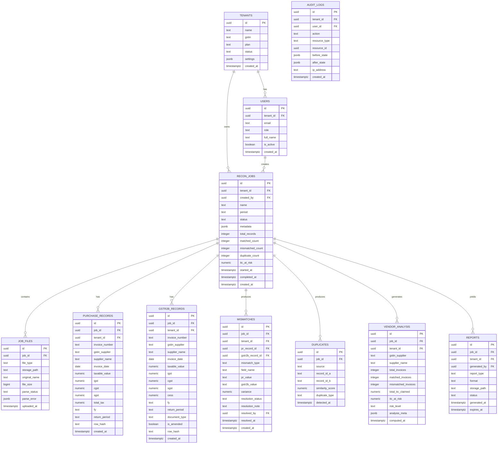

---

### 5.2 SQL: Core Tables

```sql
-- Enable RLS on all tables
ALTER TABLE tenants ENABLE ROW LEVEL SECURITY;
ALTER TABLE recon_jobs ENABLE ROW LEVEL SECURITY;
ALTER TABLE mismatches ENABLE ROW LEVEL SECURITY;

-- Tenant isolation policy (applied to all user-facing tables)
CREATE POLICY "tenant_isolation" ON recon_jobs
    USING (tenant_id = (current_setting('app.current_tenant'))::uuid);

-- Mismatch Categories ENUM
CREATE TYPE mismatch_type AS ENUM (
    'GSTIN_MISMATCH',
    'INVOICE_NUMBER_MISMATCH',
    'AMOUNT_VARIANCE',
    'TAX_RATE_MISMATCH',
    'DATE_MISMATCH',
    'MISSING_IN_2B',
    'MISSING_IN_PR',
    'DUPLICATE_INVOICE'
);

-- Job Status ENUM
CREATE TYPE job_status AS ENUM (
    'queued',
    'uploading',
    'parsing',
    'normalizing',
    'reconciling',
    'analyzing',
    'generating_report',
    'completed',
    'failed',
    'cancelled'
);

-- Resolution Status
CREATE TYPE resolution_status AS ENUM (
    'open',
    'in_review',
    'resolved',
    'disputed',
    'accepted'
);

-- Risk Level
CREATE TYPE risk_level AS ENUM ('low', 'medium', 'high', 'critical');

-- Indexes for query performance
CREATE INDEX idx_recon_jobs_tenant ON recon_jobs(tenant_id, status, created_at DESC);
CREATE INDEX idx_purchase_records_job ON purchase_records(job_id, gstin_supplier);
CREATE INDEX idx_gstr2b_records_job ON gstr2b_records(job_id, gstin_supplier);
CREATE INDEX idx_mismatches_job_type ON mismatches(job_id, mismatch_type, resolution_status);
CREATE INDEX idx_vendor_analysis_job ON vendor_analysis(job_id, risk_level);
CREATE INDEX idx_audit_logs_tenant ON audit_logs(tenant_id, created_at DESC);

-- Unique constraint to prevent duplicate row processing
CREATE UNIQUE INDEX idx_pr_row_hash ON purchase_records(job_id, row_hash);
CREATE UNIQUE INDEX idx_2b_row_hash ON gstr2b_records(job_id, row_hash);
```

---

### 5.3 Row-Level Security Model

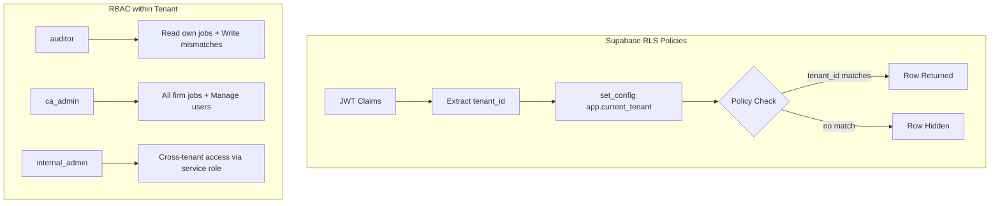

---

## 6. Background Jobs

### 6.1 Queue Architecture

**Technology**: ARQ (Python async job queue on Redis)

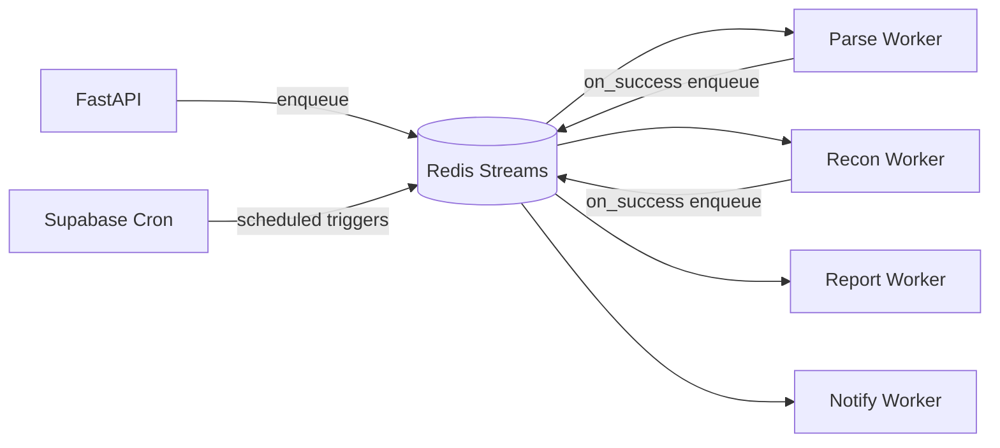

---

### 6.2 Task Definitions

#### Task 1: `parse_task`
```
Trigger: POST /upload/confirm
Input: job_id, file_paths[]
Steps:
  1. Download PR file from Supabase Storage
  2. Parse Excel/CSV with Pandas
  3. Normalize fields (GSTIN format, date, amounts)
  4. Compute row_hash (SHA-256 of canonical fields)
  5. Bulk-insert into purchase_records (upsert on row_hash)
  6. Repeat for GSTR-2B (JSON from GST Portal / Excel)
  7. Update job status → "normalizing"
  8. Enqueue recon_task
On failure: Set job status → "failed", store error JSON
Timeout: 10 minutes
Retry: 2x with exponential backoff
```

#### Task 2: `recon_task`
```
Trigger: parse_task success
Input: job_id
Steps:
  1. Export normalized PR + 2B data to temp CSV
  2. Invoke Reconlify CLI:
     reconlify recon --pr /tmp/pr.csv --gstr2b /tmp/2b.csv --out /tmp/out/
  3. Parse output files (matched.csv, mismatches.csv, unmatched.csv)
  4. Run mismatch_classifier.py to categorize mismatches
  5. Run duplicate_detector.py (exact + fuzzy with RapidFuzz)
  6. Bulk-insert into mismatches + duplicates tables
  7. Compute vendor_analysis aggregates
  8. Update recon_jobs summary counts + itc_at_risk
  9. Update job status → "completed"
  10. Enqueue report_task + notify_task
Timeout: 20 minutes
Retry: 1x
```

#### Task 3: `report_task`
```
Trigger: recon_task success
Input: job_id, report_types[]
Steps:
  1. Query all mismatches, vendor_analysis, summary for job
  2. Generate Excel report via OpenPyXL:
     - Sheet 1: Executive Summary
     - Sheet 2: Matched Records
     - Sheet 3: Mismatches (colored by type)
     - Sheet 4: Duplicates
     - Sheet 5: Vendor Risk Table
  3. Generate PDF via Jinja2 + WeasyPrint
  4. Upload to Supabase Storage (reports/{tenant_id}/{job_id}/)
  5. Insert record into reports table with signed URL TTL
  6. Update job status → "report_ready"
Timeout: 5 minutes
```

#### Task 4: `notify_task`
```
Trigger: recon_task success
Input: job_id
Steps:
  1. Fetch job creator email
  2. Send email via Resend API:
     - Summary of mismatches found
     - ITC at risk amount
     - Link to dashboard
  3. Update Supabase Realtime (broadcast to job channel)
  4. If firm has webhook configured: POST to webhook URL
Timeout: 1 minute
```

---

### 6.3 Scheduled Jobs (Supabase Edge Cron)

| Job | Schedule | Purpose |
|-----|----------|---------|
| `cleanup_temp_files` | `0 2 * * *` | Delete processed temp files from storage |
| `expire_reports` | `0 3 * * *` | Remove reports past TTL, update DB |
| `compute_tenant_usage` | `0 0 1 * *` | Monthly billing usage aggregation |
| `requeue_stuck_jobs` | `*/15 * * * *` | Detect and re-queue jobs stuck >30 min |
| `audit_log_archive` | `0 1 * * 0` | Archive old audit logs to cold storage |

---

## 7. Security Architecture

### 7.1 Security Layers

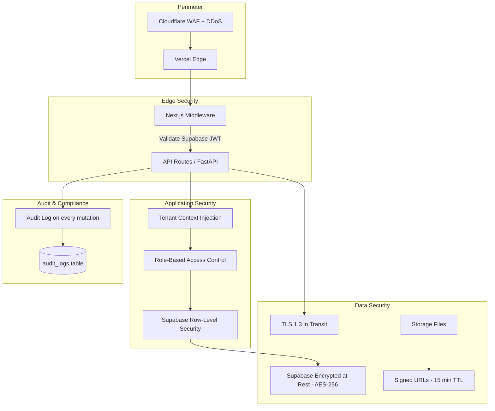

---

### 7.2 Authentication Flow

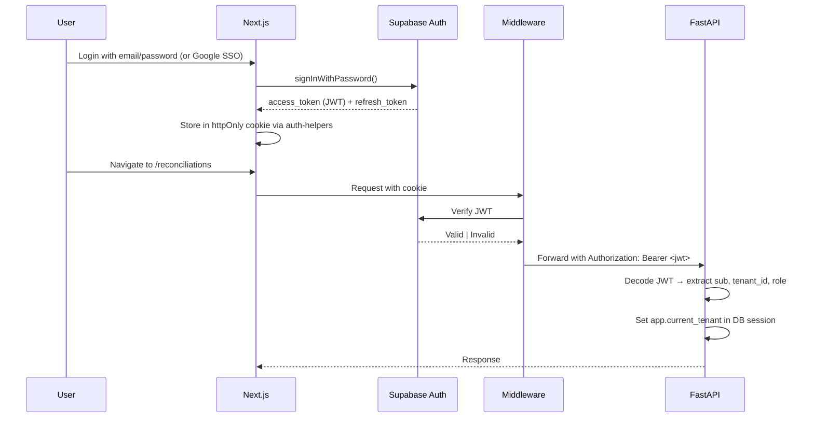

---

### 7.3 Security Controls Checklist

| Control | Implementation |
|---------|----------------|
| **Auth** | Supabase Auth (JWT, refresh tokens, MFA ready) |
| **Session** | httpOnly cookies, 1-hour JWT, 7-day refresh |
| **CSRF** | SameSite=Strict cookies + CSRF token on mutations |
| **XSS** | React + CSP headers via Vercel config |
| **SQL Injection** | Parameterized queries via asyncpg |
| **IDOR** | RLS enforces tenant isolation at DB level |
| **File Validation** | MIME check + file size limit (25MB) + malware scan hook |
| **Rate Limiting** | Upstash Redis rate limiter on upload + auth endpoints |
| **Secrets** | Doppler secrets management (never in .env files) |
| **Audit Trail** | All mutations logged with before/after state |
| **GSTIN PII** | GSTIN treated as PII — masked in logs |
| **Storage Access** | All files accessed via signed URLs (15 min TTL) |
| **API Keys** | Internal service-to-service via shared secret header |

---

### 7.4 Mismatch Classification Rules

```python
# services/reconciliation/mismatch_classifier.py

MISMATCH_RULES = {
    "GSTIN_MISMATCH": lambda pr, b: pr.gstin != b.gstin,
    "AMOUNT_VARIANCE": lambda pr, b: abs(pr.taxable_value - b.taxable_value) > 1.0,
    "TAX_RATE_MISMATCH": lambda pr, b: pr.total_tax_rate != b.total_tax_rate,
    "DATE_MISMATCH": lambda pr, b: pr.invoice_date != b.invoice_date,
    "MISSING_IN_2B": lambda pr, b: b is None,
    "MISSING_IN_PR": lambda pr, b: pr is None,
}

ITC_AT_RISK_RULES = ["MISSING_IN_2B", "GSTIN_MISMATCH", "AMOUNT_VARIANCE"]
```

---

## 8. Storage Architecture

### 8.1 Supabase Storage Bucket Layout

```
supabase-storage/
├── uploads/                              # Raw uploaded files (private)
│   └── {tenant_id}/
│       └── {job_id}/
│           ├── purchase_register.xlsx
│           └── gstr2b.json
│
├── processed/                            # Normalized temp CSVs (private)
│   └── {tenant_id}/
│       └── {job_id}/
│           ├── pr_normalized.csv
│           └── gstr2b_normalized.csv
│
├── reports/                              # Generated reports (private + signed)
│   └── {tenant_id}/
│       └── {job_id}/
│           ├── recon_report_{date}.xlsx
│           └── recon_report_{date}.pdf
│
└── exports/                              # User-initiated data exports (TTL 24h)
    └── {tenant_id}/
        └── {export_id}.csv
```

---

### 8.2 Storage Security Policies

```sql
-- Only authenticated users of the same tenant can access their uploads
CREATE POLICY "tenant_upload_access" ON storage.objects
    FOR ALL USING (
        (storage.foldername(name))[1] = 'uploads' AND
        (storage.foldername(name))[2] = auth.jwt()->>'tenant_id'
    );

-- Reports are accessible only via server-side signed URLs
-- No direct public access
CREATE POLICY "reports_server_only" ON storage.objects
    FOR SELECT USING (false);  -- FastAPI service role bypasses RLS
```

### 8.3 File Lifecycle

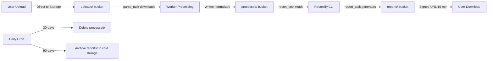

---

## 9. Deployment Architecture

### 9.1 Environment Strategy

| Environment | Frontend | Backend | Database |
|-------------|----------|---------|----------|
| **Development** | `localhost:3000` | `localhost:8000` | Supabase Local / Docker |
| **Staging** | Vercel Preview | Fly.io staging app | Supabase staging project |
| **Production** | Vercel Production | Fly.io production | Supabase production project |

---

### 9.2 Infrastructure Diagram

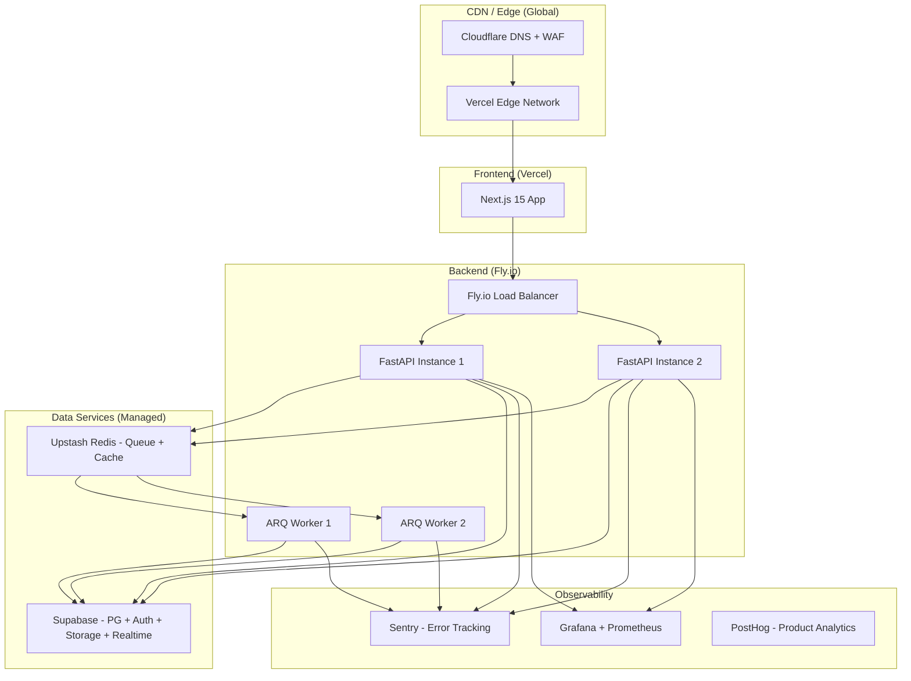

---

### 9.3 Fly.io Deployment Config

```toml
# fly.toml (FastAPI)
app = "recko-api"
primary_region = "bom"          # Mumbai for India-first

[build]
  dockerfile = "Dockerfile"

[http_service]
  internal_port = 8000
  force_https = true
  auto_stop_machines = "stop"
  auto_start_machines = true
  min_machines_running = 1

[[vm]]
  memory = "2gb"
  cpu_kind = "performance"
  cpus = 2

[mounts]
  source = "reconlify_tmp"
  destination = "/tmp/reconlify"
```

```toml
# fly.toml (ARQ Workers)
app = "recko-workers"
primary_region = "bom"

[build]
  dockerfile = "Dockerfile.worker"

[[vm]]
  memory = "4gb"          # Workers need more RAM for Pandas + Reconlify
  cpu_kind = "performance"
  cpus = 4
```

---

### 9.4 Docker Configuration

```dockerfile
# Dockerfile (FastAPI)
FROM python:3.12-slim

WORKDIR /app
RUN apt-get update && apt-get install -y \
    libpq-dev gcc curl \
    && rm -rf /var/lib/apt/lists/*

# Install Reconlify CLI
RUN curl -sSL https://install.reconlify.io | bash

COPY pyproject.toml .
RUN pip install --no-cache-dir -e ".[prod]"

COPY . .

CMD ["uvicorn", "app.main:app", "--host", "0.0.0.0", "--port", "8000", "--workers", "4"]
```

---

### 9.5 CI/CD Pipeline

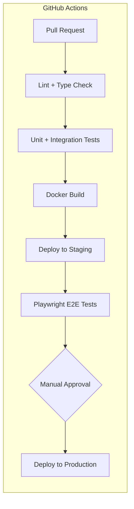

```yaml
# .github/workflows/deploy.yml (excerpt)
jobs:
  deploy-api:
    runs-on: ubuntu-latest
    steps:
      - uses: actions/checkout@v4
      - uses: superfly/flyctl-actions/setup-flyctl@master
      - run: flyctl deploy --app recko-api --remote-only
        env:
          FLY_API_TOKEN: ${{ secrets.FLY_API_TOKEN }}

  deploy-workers:
    needs: deploy-api
    runs-on: ubuntu-latest
    steps:
      - uses: superfly/flyctl-actions/setup-flyctl@master
      - run: flyctl deploy --app recko-workers --remote-only
```

---

### 9.6 Environment Variables

```bash
# Frontend (Vercel)
NEXT_PUBLIC_SUPABASE_URL=
NEXT_PUBLIC_SUPABASE_ANON_KEY=
NEXT_PUBLIC_API_URL=https://api.recko.app
NEXT_PUBLIC_POSTHOG_KEY=

# Backend (Fly.io via Doppler)
SUPABASE_URL=
SUPABASE_SERVICE_ROLE_KEY=       # Bypasses RLS for worker operations
DATABASE_URL=                    # Direct asyncpg connection
REDIS_URL=                       # Upstash Redis
INTERNAL_API_SECRET=             # Service-to-service shared secret
RESEND_API_KEY=                  # Email notifications
SENTRY_DSN=
RECONLIFY_LICENSE_KEY=
```

---

## 10. Core Workflow Pipeline

### 10.1 End-to-End Flow

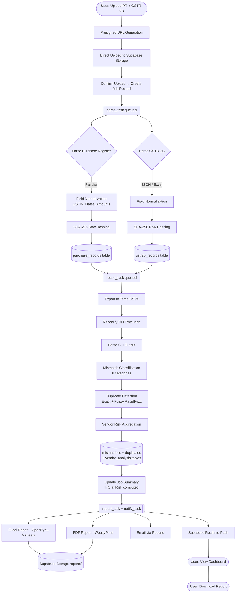

---

### 10.2 Mismatch Categories

| Category | Rule | ITC Impact |
|----------|------|------------|
| `MISSING_IN_2B` | Invoice in PR but not in GSTR-2B | **High — ITC denied** |
| `MISSING_IN_PR` | Invoice in 2B but not in PR | Medium — possible omission |
| `GSTIN_MISMATCH` | Supplier GSTIN differs | **High — invalid ITC** |
| `AMOUNT_VARIANCE` | Taxable value variance > ₹1 | High |
| `TAX_RATE_MISMATCH` | Tax rate differs | Medium |
| `DATE_MISMATCH` | Invoice date differs | Low |
| `INVOICE_NUMBER_MISMATCH` | Invoice number format differs | Low |
| `DUPLICATE_INVOICE` | Same invoice appears twice | **High — ITC inflated** |

---

### 10.3 Vendor Risk Scoring

```python
def compute_risk_level(vendor: VendorStats) -> str:
    score = 0
    if vendor.mismatch_rate > 0.30:     score += 3
    elif vendor.mismatch_rate > 0.10:   score += 2
    elif vendor.mismatch_rate > 0.05:   score += 1

    if vendor.itc_at_risk > 100_000:    score += 3
    elif vendor.itc_at_risk > 10_000:   score += 2
    elif vendor.itc_at_risk > 1_000:    score += 1

    if vendor.has_gstin_mismatch:       score += 2
    if vendor.has_duplicates:           score += 2

    if score >= 6:   return "critical"
    elif score >= 4: return "high"
    elif score >= 2: return "medium"
    else:            return "low"
```

---

## Appendix: Tech Decisions Summary

| Decision | Choice | Rationale |
|----------|--------|-----------|
| **Job Queue** | ARQ + Redis | Async Python, lightweight, Redis-native |
| **File Parsing** | Pandas + OpenPyXL | Battle-tested for Excel/CSV financial data |
| **PDF Generation** | WeasyPrint + Jinja2 | CSS-styled PDFs, no headless Chrome |
| **Fuzzy Matching** | RapidFuzz | 10x faster than fuzzywuzzy, Levenshtein |
| **Realtime** | Supabase Realtime | WebSocket job status without polling |
| **Email** | Resend | Modern API, React Email templates |
| **Secrets** | Doppler | Centralized, audit-logged secret management |
| **Observability** | Sentry + Grafana | Error tracking + infra metrics |
| **Analytics** | PostHog | Self-hostable product analytics |
| **Region** | Mumbai (bom) | India-first, GST data stays in India |
