# Recko v4 — Complete PostgreSQL Schema
## GST Reconciliation & Audit Intelligence Platform

---

## 1. Entity Relationship Diagram

```mermaid
erDiagram

    USERS {
        uuid id PK "references auth.users"
        uuid client_id FK
        text full_name
        text email
        user_role role
        boolean is_active
        jsonb preferences
        timestamptz last_login_at
        timestamptz created_at
        timestamptz updated_at
        uuid created_by FK
    }

    CLIENTS {
        uuid id PK
        text name
        text gstin
        text pan
        text address
        text city
        text state
        text pincode
        text contact_email
        text contact_phone
        client_plan plan
        client_status status
        integer max_users
        integer max_projects
        jsonb settings
        timestamptz plan_expires_at
        timestamptz created_at
        timestamptz updated_at
        uuid created_by FK
    }

    PROJECTS {
        uuid id PK
        uuid client_id FK
        uuid created_by FK
        text name
        text description
        text fy
        text return_period
        project_status status
        jsonb config
        timestamptz created_at
        timestamptz updated_at
        uuid updated_by FK
    }

    UPLOADS {
        uuid id PK
        uuid project_id FK
        uuid client_id FK
        uuid uploaded_by FK
        upload_type file_type
        text original_filename
        text storage_path
        bigint file_size_bytes
        text mime_type
        upload_status status
        integer total_rows
        integer parsed_rows
        integer error_rows
        jsonb parse_errors
        text row_hash_salt
        timestamptz uploaded_at
        timestamptz parsed_at
    }

    RECONCILIATION_RUNS {
        uuid id PK
        uuid project_id FK
        uuid client_id FK
        uuid upload_pr_id FK
        uuid upload_2b_id FK
        uuid triggered_by FK
        run_status status
        integer total_pr_records
        integer total_2b_records
        integer matched_count
        integer unmatched_pr_count
        integer unmatched_2b_count
        integer duplicate_count
        numeric total_itc_claimed
        numeric itc_at_risk
        numeric itc_matched
        jsonb run_config
        jsonb error_detail
        text reconlify_version
        timestamptz started_at
        timestamptz completed_at
        timestamptz created_at
        uuid created_by FK
    }

    MATCHED_RECORDS {
        uuid id PK
        uuid run_id FK
        uuid client_id FK
        uuid pr_upload_id FK
        uuid gstr2b_upload_id FK
        text invoice_number
        text gstin_supplier
        text supplier_name
        date invoice_date
        numeric pr_taxable_value
        numeric gstr2b_taxable_value
        numeric pr_igst
        numeric gstr2b_igst
        numeric pr_cgst
        numeric gstr2b_cgst
        numeric pr_sgst
        numeric gstr2b_sgst
        numeric value_variance
        match_confidence confidence
        text pr_row_hash
        text gstr2b_row_hash
        timestamptz created_at
    }

    UNMATCHED_RECORDS {
        uuid id PK
        uuid run_id FK
        uuid client_id FK
        text source
        text invoice_number
        text gstin_supplier
        text supplier_name
        date invoice_date
        numeric taxable_value
        numeric igst
        numeric cgst
        numeric sgst
        numeric total_tax
        mismatch_category category
        text[] mismatch_fields
        numeric itc_impact
        unmatched_status status
        text resolution_note
        uuid resolved_by FK
        timestamptz resolved_at
        text row_hash
        timestamptz created_at
        timestamptz updated_at
    }

    DUPLICATE_RECORDS {
        uuid id PK
        uuid run_id FK
        uuid client_id FK
        text source
        text record_id_a
        text record_id_b
        text invoice_number
        text gstin_supplier
        duplicate_type dtype
        numeric similarity_score
        jsonb diff_fields
        duplicate_status status
        uuid reviewed_by FK
        timestamptz reviewed_at
        timestamptz detected_at
    }

    VENDORS {
        uuid id PK
        uuid client_id FK
        text gstin
        text name
        text pan
        text state_code
        boolean gstin_active
        boolean gstin_verified
        timestamptz gstin_verified_at
        integer total_runs
        integer total_invoices
        numeric cumulative_itc_claimed
        numeric cumulative_itc_at_risk
        numeric avg_mismatch_rate
        vendor_risk_level risk_level
        jsonb tags
        timestamptz created_at
        timestamptz updated_at
    }

    VENDOR_RUN_STATS {
        uuid id PK
        uuid vendor_id FK
        uuid run_id FK
        uuid client_id FK
        integer pr_invoices
        integer gstr2b_invoices
        integer matched_invoices
        integer mismatched_invoices
        numeric itc_claimed
        numeric itc_matched
        numeric itc_at_risk
        numeric mismatch_rate
        vendor_risk_level risk_level
        timestamptz computed_at
    }

    REPORTS {
        uuid id PK
        uuid run_id FK
        uuid client_id FK
        uuid generated_by FK
        report_type rtype
        report_format rformat
        report_status status
        text storage_path
        bigint file_size_bytes
        text download_token
        timestamptz token_expires_at
        timestamptz generated_at
        timestamptz expires_at
    }

    AUDIT_LOGS {
        uuid id PK
        uuid client_id FK
        uuid user_id FK
        text action
        text resource_type
        uuid resource_id
        jsonb before_state
        jsonb after_state
        text ip_address
        text user_agent
        timestamptz created_at
    }

    CLIENTS     ||--o{ USERS                : "has members"
    CLIENTS     ||--o{ PROJECTS             : "owns"
    CLIENTS     ||--o{ VENDORS              : "tracks"
    CLIENTS     ||--o{ AUDIT_LOGS           : "records"

    PROJECTS    ||--o{ UPLOADS              : "has files"
    PROJECTS    ||--o{ RECONCILIATION_RUNS  : "produces"

    UPLOADS     ||--o| RECONCILIATION_RUNS  : "pr_upload"
    UPLOADS     ||--o| RECONCILIATION_RUNS  : "2b_upload"

    RECONCILIATION_RUNS ||--o{ MATCHED_RECORDS   : "yields"
    RECONCILIATION_RUNS ||--o{ UNMATCHED_RECORDS  : "flags"
    RECONCILIATION_RUNS ||--o{ DUPLICATE_RECORDS  : "detects"
    RECONCILIATION_RUNS ||--o{ VENDOR_RUN_STATS   : "aggregates"
    RECONCILIATION_RUNS ||--o{ REPORTS            : "generates"

    VENDORS     ||--o{ VENDOR_RUN_STATS : "per-run stats"

    USERS       ||--o{ RECONCILIATION_RUNS  : "triggers"
    USERS       ||--o{ REPORTS              : "generates"
    USERS       ||--o{ UNMATCHED_RECORDS    : "resolves"
```



---

## 2. SQL Migration

### 2.1 Extensions & Setup

```sql
-- ============================================================
-- RECKO V4 — COMPLETE DATABASE MIGRATION
-- Version: 001_initial_schema
-- Created: 2024-01
-- ============================================================

-- Required extensions
CREATE EXTENSION IF NOT EXISTS "uuid-ossp";
CREATE EXTENSION IF NOT EXISTS "pg_trgm";      -- Trigram for fuzzy vendor name search
CREATE EXTENSION IF NOT EXISTS "btree_gin";    -- GIN indexes on composite types
CREATE EXTENSION IF NOT EXISTS "unaccent";     -- Unicode-safe text search

-- ============================================================
-- SECTION 1: ENUM TYPES
-- ============================================================

CREATE TYPE user_role AS ENUM (
    'internal_admin',    -- Recko platform admin (cross-client)
    'client_admin',      -- CA Firm admin (manages firm users)
    'auditor',           -- Day-to-day reconciliation work
    'viewer'             -- Read-only access (client stakeholder)
);

CREATE TYPE client_plan AS ENUM (
    'free',
    'starter',
    'professional',
    'enterprise'
);

CREATE TYPE client_status AS ENUM (
    'active',
    'suspended',
    'trial',
    'churned'
);

CREATE TYPE project_status AS ENUM (
    'draft',
    'active',
    'archived',
    'deleted'
);

CREATE TYPE upload_type AS ENUM (
    'purchase_register',
    'gstr_2b',
    'gstr_2a'          -- future support
);

CREATE TYPE upload_status AS ENUM (
    'pending',
    'uploading',
    'uploaded',
    'parsing',
    'parsed',
    'parse_failed',
    'archived'
);

CREATE TYPE run_status AS ENUM (
    'queued',
    'parsing',
    'normalizing',
    'reconciling',
    'analyzing',
    'generating_report',
    'completed',
    'failed',
    'cancelled'
);

CREATE TYPE mismatch_category AS ENUM (
    'MISSING_IN_2B',
    'MISSING_IN_PR',
    'GSTIN_MISMATCH',
    'INVOICE_NUMBER_MISMATCH',
    'AMOUNT_VARIANCE',
    'TAX_RATE_MISMATCH',
    'DATE_MISMATCH',
    'DUPLICATE_INVOICE',
    'SUPPLIER_NAME_MISMATCH',
    'RETURN_PERIOD_MISMATCH'
);

CREATE TYPE match_confidence AS ENUM (
    'exact',
    'high',
    'medium',
    'low'
);

CREATE TYPE unmatched_status AS ENUM (
    'open',
    'in_review',
    'resolved',
    'accepted_variance',
    'disputed',
    'escalated'
);

CREATE TYPE duplicate_type AS ENUM (
    'exact_duplicate',
    'fuzzy_duplicate',
    'split_invoice',
    'amended_original'
);

CREATE TYPE duplicate_status AS ENUM (
    'flagged',
    'confirmed',
    'false_positive',
    'merged'
);

CREATE TYPE vendor_risk_level AS ENUM (
    'low',
    'medium',
    'high',
    'critical'
);

CREATE TYPE report_type AS ENUM (
    'full_reconciliation',
    'mismatch_summary',
    'itc_risk_report',
    'vendor_analysis',
    'duplicate_report',
    'audit_ready'
);

CREATE TYPE report_format AS ENUM (
    'xlsx',
    'pdf',
    'csv'
);

CREATE TYPE report_status AS ENUM (
    'queued',
    'generating',
    'ready',
    'failed',
    'expired'
);
```

---

### 2.2 Core Tables

```sql
-- ============================================================
-- SECTION 2: CORE TABLES
-- ============================================================

-- ────────────────────────────────────────────────────────────
-- TABLE: clients
-- Root of multi-tenancy. Each CA Firm / Enterprise = 1 client.
-- ────────────────────────────────────────────────────────────
CREATE TABLE clients (
    id                  UUID PRIMARY KEY DEFAULT uuid_generate_v4(),
    name                TEXT NOT NULL,
    gstin               TEXT,                        -- Primary GSTIN of the firm itself
    pan                 TEXT,
    address             TEXT,
    city                TEXT,
    state               TEXT,
    pincode             TEXT,
    contact_email       TEXT NOT NULL,
    contact_phone       TEXT,
    plan                client_plan NOT NULL DEFAULT 'free',
    status              client_status NOT NULL DEFAULT 'trial',
    max_users           INTEGER NOT NULL DEFAULT 5,
    max_projects        INTEGER NOT NULL DEFAULT 10,
    settings            JSONB NOT NULL DEFAULT '{}'::jsonb,
    plan_expires_at     TIMESTAMPTZ,
    created_at          TIMESTAMPTZ NOT NULL DEFAULT NOW(),
    updated_at          TIMESTAMPTZ NOT NULL DEFAULT NOW(),
    created_by          UUID,                        -- NULL on first seed (bootstrap)

    CONSTRAINT clients_gstin_format CHECK (
        gstin IS NULL OR gstin ~ '^[0-9]{2}[A-Z]{5}[0-9]{4}[A-Z]{1}[1-9A-Z]{1}Z[0-9A-Z]{1}$'
    ),
    CONSTRAINT clients_pan_format CHECK (
        pan IS NULL OR pan ~ '^[A-Z]{5}[0-9]{4}[A-Z]{1}$'
    )
);

-- ────────────────────────────────────────────────────────────
-- TABLE: users
-- Extends auth.users from Supabase Auth.
-- One row per authenticated user, linked by id = auth.users.id
-- ────────────────────────────────────────────────────────────
CREATE TABLE users (
    id                  UUID PRIMARY KEY REFERENCES auth.users(id) ON DELETE CASCADE,
    client_id           UUID NOT NULL REFERENCES clients(id) ON DELETE RESTRICT,
    full_name           TEXT NOT NULL,
    email               TEXT NOT NULL,
    role                user_role NOT NULL DEFAULT 'auditor',
    is_active           BOOLEAN NOT NULL DEFAULT true,
    preferences         JSONB NOT NULL DEFAULT '{}'::jsonb,
    last_login_at       TIMESTAMPTZ,
    created_at          TIMESTAMPTZ NOT NULL DEFAULT NOW(),
    updated_at          TIMESTAMPTZ NOT NULL DEFAULT NOW(),
    created_by          UUID REFERENCES users(id) ON DELETE SET NULL,

    CONSTRAINT users_email_unique UNIQUE (email),
    CONSTRAINT users_role_admin_check CHECK (
        -- internal_admin users cannot be scoped to a client (enforced in app layer)
        TRUE
    )
);

-- Back-fill created_by on clients now that users table exists
ALTER TABLE clients
    ADD CONSTRAINT clients_created_by_fk
    FOREIGN KEY (created_by) REFERENCES users(id) ON DELETE SET NULL;

-- ────────────────────────────────────────────────────────────
-- TABLE: projects
-- A project = one reconciliation period for one GSTIN/entity
-- Scoped to a client.
-- ────────────────────────────────────────────────────────────
CREATE TABLE projects (
    id                  UUID PRIMARY KEY DEFAULT uuid_generate_v4(),
    client_id           UUID NOT NULL REFERENCES clients(id) ON DELETE RESTRICT,
    created_by          UUID NOT NULL REFERENCES users(id) ON DELETE RESTRICT,
    name                TEXT NOT NULL,
    description         TEXT,
    fy                  TEXT NOT NULL,               -- e.g. "2024-25"
    return_period       TEXT NOT NULL,               -- e.g. "042024" (MMYYYY)
    gstin_entity        TEXT,                        -- GSTIN being reconciled (may differ from client)
    status              project_status NOT NULL DEFAULT 'draft',
    config              JSONB NOT NULL DEFAULT '{}'::jsonb,
    created_at          TIMESTAMPTZ NOT NULL DEFAULT NOW(),
    updated_at          TIMESTAMPTZ NOT NULL DEFAULT NOW(),
    updated_by          UUID REFERENCES users(id) ON DELETE SET NULL,

    CONSTRAINT projects_fy_format CHECK (fy ~ '^\d{4}-\d{2}$'),
    CONSTRAINT projects_period_format CHECK (return_period ~ '^\d{6}$')
);

-- ────────────────────────────────────────────────────────────
-- TABLE: uploads
-- Tracks each file uploaded — PR or GSTR-2B.
-- Storage path points to Supabase Storage object.
-- ────────────────────────────────────────────────────────────
CREATE TABLE uploads (
    id                  UUID PRIMARY KEY DEFAULT uuid_generate_v4(),
    project_id          UUID NOT NULL REFERENCES projects(id) ON DELETE RESTRICT,
    client_id           UUID NOT NULL REFERENCES clients(id) ON DELETE RESTRICT,
    uploaded_by         UUID NOT NULL REFERENCES users(id) ON DELETE RESTRICT,
    file_type           upload_type NOT NULL,
    original_filename   TEXT NOT NULL,
    storage_path        TEXT NOT NULL,               -- e.g. uploads/{client_id}/{project_id}/{id}/pr.xlsx
    file_size_bytes     BIGINT NOT NULL,
    mime_type           TEXT NOT NULL,
    status              upload_status NOT NULL DEFAULT 'pending',
    total_rows          INTEGER,
    parsed_rows         INTEGER,
    error_rows          INTEGER DEFAULT 0,
    parse_errors        JSONB DEFAULT '[]'::jsonb,
    row_hash_salt       TEXT NOT NULL DEFAULT uuid_generate_v4()::text,
    uploaded_at         TIMESTAMPTZ NOT NULL DEFAULT NOW(),
    parsed_at           TIMESTAMPTZ,

    CONSTRAINT uploads_file_size_positive CHECK (file_size_bytes > 0),
    CONSTRAINT uploads_mime_type_check CHECK (
        mime_type IN (
            'application/vnd.openxmlformats-officedocument.spreadsheetml.sheet',
            'application/vnd.ms-excel',
            'text/csv',
            'application/json'
        )
    )
);
```

---

### 2.3 Reconciliation Tables

```sql
-- ────────────────────────────────────────────────────────────
-- TABLE: reconciliation_runs
-- One run = one complete PR vs GSTR-2B reconciliation execution.
-- Stores aggregate stats and links to the two upload files.
-- ────────────────────────────────────────────────────────────
CREATE TABLE reconciliation_runs (
    id                      UUID PRIMARY KEY DEFAULT uuid_generate_v4(),
    project_id              UUID NOT NULL REFERENCES projects(id) ON DELETE RESTRICT,
    client_id               UUID NOT NULL REFERENCES clients(id) ON DELETE RESTRICT,
    upload_pr_id            UUID NOT NULL REFERENCES uploads(id) ON DELETE RESTRICT,
    upload_2b_id            UUID NOT NULL REFERENCES uploads(id) ON DELETE RESTRICT,
    triggered_by            UUID NOT NULL REFERENCES users(id) ON DELETE RESTRICT,

    -- Pipeline status
    status                  run_status NOT NULL DEFAULT 'queued',

    -- Input counts
    total_pr_records        INTEGER,
    total_2b_records        INTEGER,

    -- Output counts
    matched_count           INTEGER NOT NULL DEFAULT 0,
    unmatched_pr_count      INTEGER NOT NULL DEFAULT 0,
    unmatched_2b_count      INTEGER NOT NULL DEFAULT 0,
    duplicate_count         INTEGER NOT NULL DEFAULT 0,

    -- Financial summary (in INR)
    total_itc_claimed       NUMERIC(18, 2) NOT NULL DEFAULT 0,
    itc_at_risk             NUMERIC(18, 2) NOT NULL DEFAULT 0,
    itc_matched             NUMERIC(18, 2) NOT NULL DEFAULT 0,

    -- Execution metadata
    run_config              JSONB NOT NULL DEFAULT '{}'::jsonb,
    error_detail            JSONB,
    reconlify_version       TEXT,

    -- Timestamps
    started_at              TIMESTAMPTZ,
    completed_at            TIMESTAMPTZ,
    created_at              TIMESTAMPTZ NOT NULL DEFAULT NOW(),
    created_by              UUID NOT NULL REFERENCES users(id) ON DELETE RESTRICT,

    CONSTRAINT runs_different_uploads CHECK (upload_pr_id != upload_2b_id),
    CONSTRAINT runs_itc_nonnegative CHECK (
        total_itc_claimed >= 0 AND itc_at_risk >= 0 AND itc_matched >= 0
    ),
    CONSTRAINT runs_counts_nonnegative CHECK (
        matched_count >= 0 AND unmatched_pr_count >= 0 AND
        unmatched_2b_count >= 0 AND duplicate_count >= 0
    )
);

-- ────────────────────────────────────────────────────────────
-- TABLE: matched_records
-- Records successfully reconciled between PR and GSTR-2B.
-- High volume — will be the largest table.
-- ────────────────────────────────────────────────────────────
CREATE TABLE matched_records (
    id                      UUID PRIMARY KEY DEFAULT uuid_generate_v4(),
    run_id                  UUID NOT NULL REFERENCES reconciliation_runs(id) ON DELETE CASCADE,
    client_id               UUID NOT NULL REFERENCES clients(id) ON DELETE RESTRICT,
    pr_upload_id            UUID NOT NULL REFERENCES uploads(id) ON DELETE RESTRICT,
    gstr2b_upload_id        UUID NOT NULL REFERENCES uploads(id) ON DELETE RESTRICT,

    -- Invoice identity
    invoice_number          TEXT NOT NULL,
    gstin_supplier          TEXT NOT NULL,
    supplier_name           TEXT,
    invoice_date            DATE,

    -- Financial values from both sources
    pr_taxable_value        NUMERIC(18, 2),
    gstr2b_taxable_value    NUMERIC(18, 2),
    pr_igst                 NUMERIC(18, 2),
    gstr2b_igst             NUMERIC(18, 2),
    pr_cgst                 NUMERIC(18, 2),
    gstr2b_cgst             NUMERIC(18, 2),
    pr_sgst                 NUMERIC(18, 2),
    gstr2b_sgst             NUMERIC(18, 2),
    value_variance          NUMERIC(18, 2) GENERATED ALWAYS AS (
                                ABS(COALESCE(pr_taxable_value, 0) - COALESCE(gstr2b_taxable_value, 0))
                            ) STORED,

    -- Match metadata
    confidence              match_confidence NOT NULL DEFAULT 'exact',
    pr_row_hash             TEXT NOT NULL,
    gstr2b_row_hash         TEXT NOT NULL,

    created_at              TIMESTAMPTZ NOT NULL DEFAULT NOW(),

    CONSTRAINT matched_gstin_format CHECK (
        gstin_supplier ~ '^[0-9]{2}[A-Z]{5}[0-9]{4}[A-Z]{1}[1-9A-Z]{1}Z[0-9A-Z]{1}$'
    )
) PARTITION BY RANGE (created_at);

-- Partitions by quarter (create additional as needed)
CREATE TABLE matched_records_2024_q1 PARTITION OF matched_records
    FOR VALUES FROM ('2024-01-01') TO ('2024-04-01');
CREATE TABLE matched_records_2024_q2 PARTITION OF matched_records
    FOR VALUES FROM ('2024-04-01') TO ('2024-07-01');
CREATE TABLE matched_records_2024_q3 PARTITION OF matched_records
    FOR VALUES FROM ('2024-07-01') TO ('2024-10-01');
CREATE TABLE matched_records_2024_q4 PARTITION OF matched_records
    FOR VALUES FROM ('2024-10-01') TO ('2025-01-01');
CREATE TABLE matched_records_2025_q1 PARTITION OF matched_records
    FOR VALUES FROM ('2025-01-01') TO ('2025-04-01');
CREATE TABLE matched_records_2025_q2 PARTITION OF matched_records
    FOR VALUES FROM ('2025-04-01') TO ('2025-07-01');
CREATE TABLE matched_records_default  PARTITION OF matched_records DEFAULT;

-- ────────────────────────────────────────────────────────────
-- TABLE: unmatched_records
-- Records that failed to reconcile. Core audit target.
-- Tracks resolution lifecycle.
-- ────────────────────────────────────────────────────────────
CREATE TABLE unmatched_records (
    id                      UUID PRIMARY KEY DEFAULT uuid_generate_v4(),
    run_id                  UUID NOT NULL REFERENCES reconciliation_runs(id) ON DELETE CASCADE,
    client_id               UUID NOT NULL REFERENCES clients(id) ON DELETE RESTRICT,

    -- Which side this record came from
    source                  TEXT NOT NULL CHECK (source IN ('PURCHASE_REGISTER', 'GSTR_2B')),

    -- Invoice data
    invoice_number          TEXT NOT NULL,
    gstin_supplier          TEXT NOT NULL,
    supplier_name           TEXT,
    invoice_date            DATE,
    taxable_value           NUMERIC(18, 2),
    igst                    NUMERIC(18, 2),
    cgst                    NUMERIC(18, 2),
    sgst                    NUMERIC(18, 2),
    cess                    NUMERIC(18, 2) DEFAULT 0,
    total_tax               NUMERIC(18, 2) GENERATED ALWAYS AS (
                                COALESCE(igst, 0) + COALESCE(cgst, 0) +
                                COALESCE(sgst, 0) + COALESCE(cess, 0)
                            ) STORED,

    -- Classification
    category                mismatch_category NOT NULL,
    mismatch_fields         TEXT[] NOT NULL DEFAULT '{}',
    itc_impact              NUMERIC(18, 2) GENERATED ALWAYS AS (
                                COALESCE(igst, 0) + COALESCE(cgst, 0) + COALESCE(sgst, 0)
                            ) STORED,

    -- Resolution workflow
    status                  unmatched_status NOT NULL DEFAULT 'open',
    resolution_note         TEXT,
    resolved_by             UUID REFERENCES users(id) ON DELETE SET NULL,
    resolved_at             TIMESTAMPTZ,

    -- Dedup key
    row_hash                TEXT NOT NULL,

    created_at              TIMESTAMPTZ NOT NULL DEFAULT NOW(),
    updated_at              TIMESTAMPTZ NOT NULL DEFAULT NOW(),

    CONSTRAINT unmatched_gstin_format CHECK (
        gstin_supplier ~ '^[0-9]{2}[A-Z]{5}[0-9]{4}[A-Z]{1}[1-9A-Z]{1}Z[0-9A-Z]{1}$'
    ),
    CONSTRAINT unmatched_row_hash_unique UNIQUE (run_id, row_hash)
);

-- ────────────────────────────────────────────────────────────
-- TABLE: duplicate_records
-- Pairs of records detected as duplicates within a run.
-- Could be within PR, within 2B, or cross-source.
-- ────────────────────────────────────────────────────────────
CREATE TABLE duplicate_records (
    id                      UUID PRIMARY KEY DEFAULT uuid_generate_v4(),
    run_id                  UUID NOT NULL REFERENCES reconciliation_runs(id) ON DELETE CASCADE,
    client_id               UUID NOT NULL REFERENCES clients(id) ON DELETE RESTRICT,

    source                  TEXT NOT NULL CHECK (source IN ('PURCHASE_REGISTER', 'GSTR_2B', 'CROSS')),
    record_id_a             TEXT NOT NULL,           -- Row hash of first record
    record_id_b             TEXT NOT NULL,           -- Row hash of second record
    invoice_number          TEXT NOT NULL,
    gstin_supplier          TEXT NOT NULL,

    dtype                   duplicate_type NOT NULL,
    similarity_score        NUMERIC(5, 4) NOT NULL   -- 0.0000 – 1.0000
                            CHECK (similarity_score BETWEEN 0 AND 1),
    diff_fields             JSONB NOT NULL DEFAULT '{}'::jsonb,

    -- Review workflow
    status                  duplicate_status NOT NULL DEFAULT 'flagged',
    reviewed_by             UUID REFERENCES users(id) ON DELETE SET NULL,
    reviewed_at             TIMESTAMPTZ,

    detected_at             TIMESTAMPTZ NOT NULL DEFAULT NOW(),

    CONSTRAINT duplicate_pair_unique UNIQUE (run_id, record_id_a, record_id_b)
);
```

---

### 2.4 Vendor & Report Tables

```sql
-- ────────────────────────────────────────────────────────────
-- TABLE: vendors
-- Cumulative vendor master per client.
-- Refreshed/upserted after each reconciliation run.
-- ────────────────────────────────────────────────────────────
CREATE TABLE vendors (
    id                          UUID PRIMARY KEY DEFAULT uuid_generate_v4(),
    client_id                   UUID NOT NULL REFERENCES clients(id) ON DELETE RESTRICT,

    -- Identity
    gstin                       TEXT NOT NULL,
    name                        TEXT NOT NULL,
    name_tsv                    TSVECTOR,                -- Full-text search
    pan                         TEXT,
    state_code                  CHAR(2),

    -- GSTIN verification
    gstin_active                BOOLEAN DEFAULT NULL,    -- NULL = not yet verified
    gstin_verified              BOOLEAN NOT NULL DEFAULT false,
    gstin_verified_at           TIMESTAMPTZ,

    -- Cumulative stats across all runs
    total_runs                  INTEGER NOT NULL DEFAULT 0,
    total_invoices              INTEGER NOT NULL DEFAULT 0,
    cumulative_itc_claimed      NUMERIC(18, 2) NOT NULL DEFAULT 0,
    cumulative_itc_at_risk      NUMERIC(18, 2) NOT NULL DEFAULT 0,
    avg_mismatch_rate           NUMERIC(5, 4) NOT NULL DEFAULT 0,

    -- Risk
    risk_level                  vendor_risk_level NOT NULL DEFAULT 'low',
    tags                        JSONB NOT NULL DEFAULT '[]'::jsonb,

    created_at                  TIMESTAMPTZ NOT NULL DEFAULT NOW(),
    updated_at                  TIMESTAMPTZ NOT NULL DEFAULT NOW(),

    CONSTRAINT vendors_client_gstin_unique UNIQUE (client_id, gstin),
    CONSTRAINT vendors_gstin_format CHECK (
        gstin ~ '^[0-9]{2}[A-Z]{5}[0-9]{4}[A-Z]{1}[1-9A-Z]{1}Z[0-9A-Z]{1}$'
    ),
    CONSTRAINT vendors_mismatch_rate_range CHECK (
        avg_mismatch_rate BETWEEN 0 AND 1
    )
);

-- ────────────────────────────────────────────────────────────
-- TABLE: vendor_run_stats
-- Per-run snapshot of vendor performance.
-- Powers per-run vendor analysis page.
-- ────────────────────────────────────────────────────────────
CREATE TABLE vendor_run_stats (
    id                  UUID PRIMARY KEY DEFAULT uuid_generate_v4(),
    vendor_id           UUID NOT NULL REFERENCES vendors(id) ON DELETE CASCADE,
    run_id              UUID NOT NULL REFERENCES reconciliation_runs(id) ON DELETE CASCADE,
    client_id           UUID NOT NULL REFERENCES clients(id) ON DELETE RESTRICT,

    pr_invoices         INTEGER NOT NULL DEFAULT 0,
    gstr2b_invoices     INTEGER NOT NULL DEFAULT 0,
    matched_invoices    INTEGER NOT NULL DEFAULT 0,
    mismatched_invoices INTEGER NOT NULL DEFAULT 0,

    itc_claimed         NUMERIC(18, 2) NOT NULL DEFAULT 0,
    itc_matched         NUMERIC(18, 2) NOT NULL DEFAULT 0,
    itc_at_risk         NUMERIC(18, 2) NOT NULL DEFAULT 0,

    mismatch_rate       NUMERIC(5, 4) NOT NULL DEFAULT 0
                        CHECK (mismatch_rate BETWEEN 0 AND 1),
    risk_level          vendor_risk_level NOT NULL DEFAULT 'low',

    computed_at         TIMESTAMPTZ NOT NULL DEFAULT NOW(),

    CONSTRAINT vendor_run_stats_unique UNIQUE (vendor_id, run_id)
);

-- ────────────────────────────────────────────────────────────
-- TABLE: reports
-- Tracks generated report files (Excel, PDF, CSV).
-- Files stored in Supabase Storage; accessed via signed URLs.
-- ────────────────────────────────────────────────────────────
CREATE TABLE reports (
    id                  UUID PRIMARY KEY DEFAULT uuid_generate_v4(),
    run_id              UUID NOT NULL REFERENCES reconciliation_runs(id) ON DELETE RESTRICT,
    client_id           UUID NOT NULL REFERENCES clients(id) ON DELETE RESTRICT,
    generated_by        UUID REFERENCES users(id) ON DELETE SET NULL,

    rtype               report_type NOT NULL,
    rformat             report_format NOT NULL,
    status              report_status NOT NULL DEFAULT 'queued',

    storage_path        TEXT,                        -- Populated when ready
    file_size_bytes     BIGINT,
    download_token      TEXT UNIQUE,                 -- Opaque token for secure download
    token_expires_at    TIMESTAMPTZ,

    generated_at        TIMESTAMPTZ,
    expires_at          TIMESTAMPTZ,                 -- Report auto-deletes after this

    CONSTRAINT reports_storage_when_ready CHECK (
        (status != 'ready') OR (storage_path IS NOT NULL)
    )
);

-- ────────────────────────────────────────────────────────────
-- TABLE: audit_logs
-- Immutable append-only log of all user actions.
-- Never update or delete rows here.
-- ────────────────────────────────────────────────────────────
CREATE TABLE audit_logs (
    id                  UUID PRIMARY KEY DEFAULT uuid_generate_v4(),
    client_id           UUID REFERENCES clients(id) ON DELETE SET NULL,
    user_id             UUID REFERENCES users(id) ON DELETE SET NULL,

    action              TEXT NOT NULL,               -- e.g. 'RESOLVE_MISMATCH', 'DELETE_PROJECT'
    resource_type       TEXT NOT NULL,               -- e.g. 'unmatched_records'
    resource_id         UUID,

    before_state        JSONB,
    after_state         JSONB,

    ip_address          INET,
    user_agent          TEXT,

    created_at          TIMESTAMPTZ NOT NULL DEFAULT NOW()
) PARTITION BY RANGE (created_at);

-- Monthly audit log partitions
CREATE TABLE audit_logs_2024_q1 PARTITION OF audit_logs
    FOR VALUES FROM ('2024-01-01') TO ('2024-04-01');
CREATE TABLE audit_logs_2024_q2 PARTITION OF audit_logs
    FOR VALUES FROM ('2024-04-01') TO ('2024-07-01');
CREATE TABLE audit_logs_2024_q3 PARTITION OF audit_logs
    FOR VALUES FROM ('2024-07-01') TO ('2024-10-01');
CREATE TABLE audit_logs_2024_q4 PARTITION OF audit_logs
    FOR VALUES FROM ('2024-10-01') TO ('2025-01-01');
CREATE TABLE audit_logs_2025_q1 PARTITION OF audit_logs
    FOR VALUES FROM ('2025-01-01') TO ('2025-04-01');
CREATE TABLE audit_logs_2025_q2 PARTITION OF audit_logs
    FOR VALUES FROM ('2025-04-01') TO ('2025-07-01');
CREATE TABLE audit_logs_default  PARTITION OF audit_logs DEFAULT;
```

---

### 2.5 Triggers (Auto-update & Derived State)

```sql
-- ============================================================
-- SECTION 3: TRIGGERS
-- ============================================================

-- ── Auto-update updated_at on every UPDATE ──
CREATE OR REPLACE FUNCTION trigger_set_updated_at()
RETURNS TRIGGER AS $$
BEGIN
    NEW.updated_at = NOW();
    RETURN NEW;
END;
$$ LANGUAGE plpgsql;

CREATE TRIGGER set_updated_at_clients
    BEFORE UPDATE ON clients
    FOR EACH ROW EXECUTE FUNCTION trigger_set_updated_at();

CREATE TRIGGER set_updated_at_users
    BEFORE UPDATE ON users
    FOR EACH ROW EXECUTE FUNCTION trigger_set_updated_at();

CREATE TRIGGER set_updated_at_projects
    BEFORE UPDATE ON projects
    FOR EACH ROW EXECUTE FUNCTION trigger_set_updated_at();

CREATE TRIGGER set_updated_at_unmatched
    BEFORE UPDATE ON unmatched_records
    FOR EACH ROW EXECUTE FUNCTION trigger_set_updated_at();

CREATE TRIGGER set_updated_at_vendors
    BEFORE UPDATE ON vendors
    FOR EACH ROW EXECUTE FUNCTION trigger_set_updated_at();

-- ── Auto-maintain vendor FTS vector ──
CREATE OR REPLACE FUNCTION trigger_update_vendor_tsv()
RETURNS TRIGGER AS $$
BEGIN
    NEW.name_tsv = to_tsvector('english', COALESCE(NEW.name, '') || ' ' || COALESCE(NEW.gstin, ''));
    RETURN NEW;
END;
$$ LANGUAGE plpgsql;

CREATE TRIGGER update_vendor_tsv
    BEFORE INSERT OR UPDATE ON vendors
    FOR EACH ROW EXECUTE FUNCTION trigger_update_vendor_tsv();

-- ── Auto-write audit log on unmatched_records resolution ──
CREATE OR REPLACE FUNCTION trigger_audit_unmatched_resolution()
RETURNS TRIGGER AS $$
BEGIN
    IF OLD.status != NEW.status THEN
        INSERT INTO audit_logs (
            client_id, user_id, action, resource_type, resource_id,
            before_state, after_state
        ) VALUES (
            NEW.client_id,
            NEW.resolved_by,
            'RESOLVE_MISMATCH',
            'unmatched_records',
            NEW.id,
            jsonb_build_object('status', OLD.status),
            jsonb_build_object('status', NEW.status, 'note', NEW.resolution_note)
        );
    END IF;
    RETURN NEW;
END;
$$ LANGUAGE plpgsql;

CREATE TRIGGER audit_unmatched_resolution
    AFTER UPDATE ON unmatched_records
    FOR EACH ROW EXECUTE FUNCTION trigger_audit_unmatched_resolution();

-- ── Enforce client user/project limits ──
CREATE OR REPLACE FUNCTION check_client_user_limit()
RETURNS TRIGGER AS $$
DECLARE
    current_count INTEGER;
    max_allowed   INTEGER;
BEGIN
    SELECT COUNT(*), c.max_users
    INTO current_count, max_allowed
    FROM users u
    JOIN clients c ON c.id = NEW.client_id
    WHERE u.client_id = NEW.client_id AND u.is_active = true
    GROUP BY c.max_users;

    IF current_count >= max_allowed THEN
        RAISE EXCEPTION 'Client has reached maximum user limit of %', max_allowed;
    END IF;
    RETURN NEW;
END;
$$ LANGUAGE plpgsql;

CREATE TRIGGER enforce_client_user_limit
    BEFORE INSERT ON users
    FOR EACH ROW EXECUTE FUNCTION check_client_user_limit();
```

---

### 2.6 Row-Level Security

```sql
-- ============================================================
-- SECTION 4: ROW-LEVEL SECURITY
-- ============================================================

-- Enable RLS on all tables
ALTER TABLE clients           ENABLE ROW LEVEL SECURITY;
ALTER TABLE users             ENABLE ROW LEVEL SECURITY;
ALTER TABLE projects          ENABLE ROW LEVEL SECURITY;
ALTER TABLE uploads           ENABLE ROW LEVEL SECURITY;
ALTER TABLE reconciliation_runs ENABLE ROW LEVEL SECURITY;
ALTER TABLE matched_records   ENABLE ROW LEVEL SECURITY;
ALTER TABLE unmatched_records ENABLE ROW LEVEL SECURITY;
ALTER TABLE duplicate_records ENABLE ROW LEVEL SECURITY;
ALTER TABLE vendors           ENABLE ROW LEVEL SECURITY;
ALTER TABLE vendor_run_stats  ENABLE ROW LEVEL SECURITY;
ALTER TABLE reports           ENABLE ROW LEVEL SECURITY;
ALTER TABLE audit_logs        ENABLE ROW LEVEL SECURITY;

-- ────────────────────────────────────────────────────────────
-- HELPER: resolves the calling user's client_id and role
-- from the Supabase JWT via auth.uid()
-- ────────────────────────────────────────────────────────────
CREATE OR REPLACE FUNCTION auth_client_id() RETURNS UUID AS $$
    SELECT client_id FROM users WHERE id = auth.uid();
$$ LANGUAGE sql STABLE SECURITY DEFINER;

CREATE OR REPLACE FUNCTION auth_role() RETURNS user_role AS $$
    SELECT role FROM users WHERE id = auth.uid();
$$ LANGUAGE sql STABLE SECURITY DEFINER;

-- ── clients ──
-- Admins see all; others see only their own client.
CREATE POLICY clients_select ON clients FOR SELECT USING (
    auth_role() = 'internal_admin' OR id = auth_client_id()
);
CREATE POLICY clients_insert ON clients FOR INSERT WITH CHECK (
    auth_role() = 'internal_admin'
);
CREATE POLICY clients_update ON clients FOR UPDATE USING (
    auth_role() = 'internal_admin' OR id = auth_client_id()
) WITH CHECK (
    auth_role() = 'internal_admin' OR id = auth_client_id()
);

-- ── users ──
CREATE POLICY users_select ON users FOR SELECT USING (
    auth_role() = 'internal_admin'
    OR client_id = auth_client_id()
);
CREATE POLICY users_insert ON users FOR INSERT WITH CHECK (
    auth_role() IN ('internal_admin', 'client_admin')
    AND client_id = auth_client_id()
);
CREATE POLICY users_update ON users FOR UPDATE USING (
    auth_role() = 'internal_admin'
    OR (auth_role() = 'client_admin' AND client_id = auth_client_id())
    OR id = auth.uid()           -- users can update their own profile
);
CREATE POLICY users_delete ON users FOR DELETE USING (
    auth_role() IN ('internal_admin', 'client_admin')
    AND client_id = auth_client_id()
);

-- ── projects ──
CREATE POLICY projects_select ON projects FOR SELECT USING (
    auth_role() = 'internal_admin'
    OR client_id = auth_client_id()
);
CREATE POLICY projects_insert ON projects FOR INSERT WITH CHECK (
    client_id = auth_client_id()
    AND auth_role() IN ('client_admin', 'auditor')
);
CREATE POLICY projects_update ON projects FOR UPDATE USING (
    auth_role() = 'internal_admin'
    OR (client_id = auth_client_id() AND auth_role() IN ('client_admin', 'auditor'))
);
CREATE POLICY projects_delete ON projects FOR DELETE USING (
    auth_role() IN ('internal_admin', 'client_admin')
    AND client_id = auth_client_id()
);

-- ── Generic tenant isolation macro (applied to all remaining tables) ──
-- Pattern: SELECT/INSERT/UPDATE/DELETE only within own client_id

DO $$ DECLARE
    tbl TEXT;
BEGIN
    FOREACH tbl IN ARRAY ARRAY[
        'uploads', 'reconciliation_runs', 'matched_records',
        'unmatched_records', 'duplicate_records', 'vendors',
        'vendor_run_stats', 'reports', 'audit_logs'
    ] LOOP
        EXECUTE format('
            CREATE POLICY %I_tenant_isolation ON %I
            USING (
                auth_role() = ''internal_admin''
                OR client_id = auth_client_id()
            )
            WITH CHECK (
                auth_role() = ''internal_admin''
                OR client_id = auth_client_id()
            );
        ', tbl || '_policy', tbl);
    END LOOP;
END $$;

-- ── Extra: viewers cannot mutate unmatched_records ──
CREATE POLICY unmatched_viewer_readonly ON unmatched_records
    FOR UPDATE USING (auth_role() != 'viewer');

-- ── Extra: only auditors+ can resolve duplicates ──
CREATE POLICY duplicate_review_policy ON duplicate_records
    FOR UPDATE USING (auth_role() IN ('internal_admin', 'client_admin', 'auditor'));
```

---

## 3. Indexes

### 3.1 Primary Lookup Indexes

```sql
-- ============================================================
-- SECTION 5: INDEXES
-- ============================================================

-- ── clients ──
CREATE INDEX idx_clients_status_plan ON clients(status, plan);
CREATE INDEX idx_clients_gstin ON clients(gstin) WHERE gstin IS NOT NULL;

-- ── users ──
CREATE INDEX idx_users_client_role ON users(client_id, role) WHERE is_active = true;
CREATE INDEX idx_users_email ON users(email);

-- ── projects ──
CREATE INDEX idx_projects_client_status ON projects(client_id, status, created_at DESC);
CREATE INDEX idx_projects_client_fy ON projects(client_id, fy, return_period);

-- ── uploads ──
CREATE INDEX idx_uploads_project_type ON uploads(project_id, file_type, status);
CREATE INDEX idx_uploads_client_status ON uploads(client_id, status);

-- ── reconciliation_runs ──
CREATE INDEX idx_runs_project_status ON reconciliation_runs(project_id, status, created_at DESC);
CREATE INDEX idx_runs_client_status  ON reconciliation_runs(client_id, status, created_at DESC);
CREATE INDEX idx_runs_triggered_by   ON reconciliation_runs(triggered_by, created_at DESC);

-- ── matched_records (partitioned) ──
-- Note: Indexes on partitioned tables apply to all partitions
CREATE INDEX idx_matched_run        ON matched_records(run_id, client_id);
CREATE INDEX idx_matched_gstin      ON matched_records(gstin_supplier);
CREATE INDEX idx_matched_invoice    ON matched_records(invoice_number, gstin_supplier);
CREATE INDEX idx_matched_confidence ON matched_records(run_id, confidence)
    WHERE confidence != 'exact';                            -- Partial: only non-exact matches

-- ── unmatched_records ──
CREATE INDEX idx_unmatched_run_cat  ON unmatched_records(run_id, category, status);
CREATE INDEX idx_unmatched_client   ON unmatched_records(client_id, status, created_at DESC);
CREATE INDEX idx_unmatched_gstin    ON unmatched_records(gstin_supplier);
CREATE INDEX idx_unmatched_open     ON unmatched_records(run_id, category)
    WHERE status = 'open';                                  -- Partial: open items only (dashboard)
CREATE INDEX idx_unmatched_itc_risk ON unmatched_records(run_id, itc_impact DESC)
    WHERE status = 'open';                                  -- For "top ITC at risk" queries

-- ── duplicate_records ──
CREATE INDEX idx_duplicates_run     ON duplicate_records(run_id, dtype, status);
CREATE INDEX idx_duplicates_gstin   ON duplicate_records(gstin_supplier);
CREATE INDEX idx_duplicates_flagged ON duplicate_records(run_id)
    WHERE status = 'flagged';

-- ── vendors ──
CREATE INDEX idx_vendors_client     ON vendors(client_id, risk_level, updated_at DESC);
CREATE INDEX idx_vendors_gstin      ON vendors(client_id, gstin);
CREATE INDEX idx_vendors_fts        ON vendors USING GIN(name_tsv);   -- Full-text search
CREATE INDEX idx_vendors_name_trgm  ON vendors USING GIN(name gin_trgm_ops); -- Fuzzy name search

-- ── vendor_run_stats ──
CREATE INDEX idx_vrs_run            ON vendor_run_stats(run_id, risk_level);
CREATE INDEX idx_vrs_vendor         ON vendor_run_stats(vendor_id, computed_at DESC);
CREATE INDEX idx_vrs_client_risk    ON vendor_run_stats(client_id, risk_level, computed_at DESC);

-- ── reports ──
CREATE INDEX idx_reports_run        ON reports(run_id, status);
CREATE INDEX idx_reports_token      ON reports(download_token) WHERE download_token IS NOT NULL;
CREATE INDEX idx_reports_expiry     ON reports(expires_at) WHERE status = 'ready'; -- For cron cleanup

-- ── audit_logs (partitioned) ──
CREATE INDEX idx_audit_client       ON audit_logs(client_id, created_at DESC);
CREATE INDEX idx_audit_user         ON audit_logs(user_id, created_at DESC);
CREATE INDEX idx_audit_resource     ON audit_logs(resource_type, resource_id);
```

---

### 3.2 Composite Indexes for Common Query Patterns

```sql
-- Dashboard: "Show me all open mismatches for a run, sorted by ITC impact"
CREATE INDEX idx_unmatched_dashboard ON unmatched_records(run_id, status, itc_impact DESC)
    INCLUDE (invoice_number, gstin_supplier, supplier_name, category);

-- Vendor analysis page: "For this run, show vendors sorted by ITC at risk"
CREATE INDEX idx_vrs_itc_risk_sorted ON vendor_run_stats(run_id, itc_at_risk DESC)
    INCLUDE (vendor_id, mismatch_rate, risk_level);

-- Report generation: "All mismatches for a run grouped by category"
CREATE INDEX idx_unmatched_report ON unmatched_records(run_id, category)
    INCLUDE (taxable_value, igst, cgst, sgst, itc_impact, source);

-- Reconciliation history: most recent completed runs per client
CREATE INDEX idx_runs_history ON reconciliation_runs(client_id, completed_at DESC)
    WHERE status = 'completed';
```

---

## 4. Performance Recommendations

### 4.1 Query Optimization

| Pattern | Recommendation |
|---------|---------------|
| **High-volume inserts** | Use `COPY` (bulk load) for `matched_records` and `unmatched_records` after a run — 10–100x faster than row-by-row INSERT |
| **Duplicate detection** | Compute row hashes in Python (Pandas) before DB insert; use `INSERT ... ON CONFLICT DO NOTHING` |
| **Dashboard aggregates** | Pre-compute `reconciliation_runs` summary columns (`matched_count`, `itc_at_risk`) during worker execution — never compute live |
| **Vendor stats** | Write to `vendor_run_stats` atomically at run completion; read from pre-aggregated table, never JOIN on raw records |
| **Mismatch resolution** | Index `WHERE status = 'open'` — resolvers only ever query open records |
| **Report download** | Use `download_token` with 15-min TTL; FastAPI issues a Supabase Storage signed URL, never exposes the storage path directly |

---

### 4.2 Connection Pooling

```
# Recommended PgBouncer / Supabase Pooler settings

FastAPI (OLTP):     pool_mode = transaction,  pool_size = 10 per instance
ARQ Workers:        pool_mode = session,       pool_size = 5 per worker
(Workers need session mode for SET LOCAL app.current_tenant)
```

---

### 4.3 Partition Management

```sql
-- Cron: Create next quarter's partition 1 month in advance
-- Run via Supabase Edge Function on schedule

CREATE OR REPLACE FUNCTION create_next_quarter_partitions()
RETURNS void AS $$
DECLARE
    next_start DATE;
    next_end   DATE;
BEGIN
    next_start := DATE_TRUNC('quarter', NOW() + INTERVAL '3 months');
    next_end   := next_start + INTERVAL '3 months';

    EXECUTE format(
        'CREATE TABLE IF NOT EXISTS matched_records_%s PARTITION OF matched_records
         FOR VALUES FROM (%L) TO (%L)',
        TO_CHAR(next_start, 'YYYY_"q"Q'),
        next_start,
        next_end
    );

    EXECUTE format(
        'CREATE TABLE IF NOT EXISTS audit_logs_%s PARTITION OF audit_logs
         FOR VALUES FROM (%L) TO (%L)',
        TO_CHAR(next_start, 'YYYY_"q"Q'),
        next_start,
        next_end
    );
END;
$$ LANGUAGE plpgsql;
```

---

### 4.4 Statistics & Autovacuum Tuning

```sql
-- matched_records and unmatched_records are write-heavy during runs,
-- then mostly read-only. Tune autovacuum per-table.

ALTER TABLE matched_records SET (
    autovacuum_vacuum_scale_factor  = 0.01,   -- Vacuum after 1% change
    autovacuum_analyze_scale_factor = 0.005
);

ALTER TABLE unmatched_records SET (
    autovacuum_vacuum_scale_factor  = 0.02,
    autovacuum_analyze_scale_factor = 0.01
);

-- audit_logs: append-only, no updates — disable vacuum on partitions
ALTER TABLE audit_logs_2024_q1 SET (autovacuum_enabled = false);
-- (apply to all past partitions once sealed)

-- Update statistics target for high-cardinality columns
ALTER TABLE unmatched_records
    ALTER COLUMN gstin_supplier SET STATISTICS 500;
ALTER TABLE matched_records
    ALTER COLUMN gstin_supplier SET STATISTICS 500;
```

---

### 4.5 Supabase Auth Integration Pattern

```sql
-- ============================================================
-- SECTION 6: SUPABASE AUTH HOOK
-- Automatically creates a users row when a new auth.user signs up.
-- Set this as the "After signup" Auth Hook in Supabase Dashboard.
-- ============================================================

CREATE OR REPLACE FUNCTION handle_new_auth_user()
RETURNS TRIGGER AS $$
BEGIN
    -- The client_id and role are passed as user_metadata during signup
    INSERT INTO public.users (id, client_id, full_name, email, role)
    VALUES (
        NEW.id,
        (NEW.raw_user_meta_data->>'client_id')::UUID,
        COALESCE(NEW.raw_user_meta_data->>'full_name', NEW.email),
        NEW.email,
        COALESCE(
            (NEW.raw_user_meta_data->>'role')::user_role,
            'auditor'
        )
    );
    RETURN NEW;
END;
$$ LANGUAGE plpgsql SECURITY DEFINER;

CREATE TRIGGER on_auth_user_created
    AFTER INSERT ON auth.users
    FOR EACH ROW EXECUTE FUNCTION handle_new_auth_user();
```

---

### 4.6 Materialized View: Client Dashboard Snapshot

```sql
-- Refreshed after every run completion by the worker
CREATE MATERIALIZED VIEW client_dashboard_stats AS
SELECT
    r.client_id,
    COUNT(DISTINCT r.id)                        AS total_runs,
    COUNT(DISTINCT r.id) FILTER (
        WHERE r.status = 'completed'
    )                                           AS completed_runs,
    SUM(r.total_itc_claimed)                    AS total_itc_claimed,
    SUM(r.itc_at_risk)                          AS total_itc_at_risk,
    SUM(r.matched_count)                        AS total_matched,
    SUM(r.unmatched_pr_count +
        r.unmatched_2b_count)                   AS total_unmatched,
    SUM(r.duplicate_count)                      AS total_duplicates,
    MAX(r.completed_at)                         AS last_run_at
FROM reconciliation_runs r
WHERE r.status = 'completed'
GROUP BY r.client_id;

CREATE UNIQUE INDEX ON client_dashboard_stats(client_id);

-- Refresh command (called by worker after run completion):
-- REFRESH MATERIALIZED VIEW CONCURRENTLY client_dashboard_stats;
```

---

### 4.7 Summary of Partitioning Strategy

| Table | Partition Key | Strategy | Rationale |
|-------|--------------|----------|-----------|
| `matched_records` | `created_at` | Quarterly range | High volume; old data rarely queried |
| `audit_logs` | `created_at` | Quarterly range | Compliance retention; archive old partitions |
| `unmatched_records` | — | No partition | Moderate volume; actively queried for resolution |
| `vendors` | — | No partition | Master data; small cardinality per client |
| `reconciliation_runs` | — | No partition | Low cardinality; all fields needed for dashboard |

---

### 4.8 Schema Version Tracking

```sql
-- Track migration versions (managed by Alembic / Supabase Migrations)
CREATE TABLE IF NOT EXISTS schema_migrations (
    version     TEXT PRIMARY KEY,
    applied_at  TIMESTAMPTZ NOT NULL DEFAULT NOW(),
    description TEXT
);

INSERT INTO schema_migrations (version, description)
VALUES ('001', 'Initial schema — Recko v4 production baseline');
```
